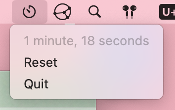

# Dead Simple and Efficient StopWatch in MenuBar.

Source code only with no license.

No support and no binary distribution of any kind.

App Icon was bluntly copied from <https://github.com/KDE/breeze-icons/blob/v6.11.0/icons/applets/256/org.kde.plasma.timer.svg>



# Similar Apps

- For Android -> <https://github.com/shenlebantongying/ArcadianStopWatch_Android>
- For Linux -> <https://github.com/shenlebantongying/mStopWatch_Linux>

# Dev

## Local Distribution

XCode 
-> Menu 
-> Product 
-> Archive 
-> Distribute App
-> Custom
-> Copy App
-> Delete extra strings in name

```sh
swift format . -i -r
```